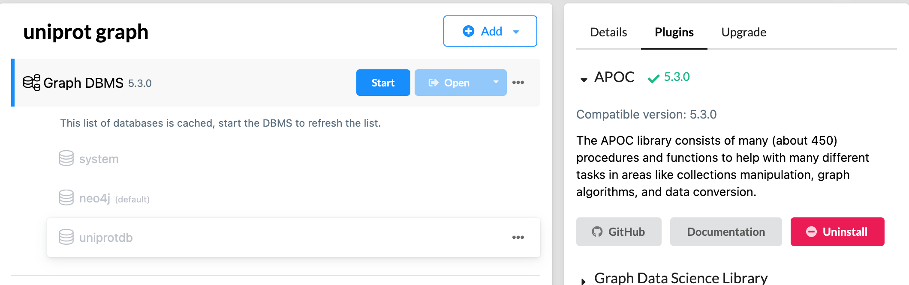
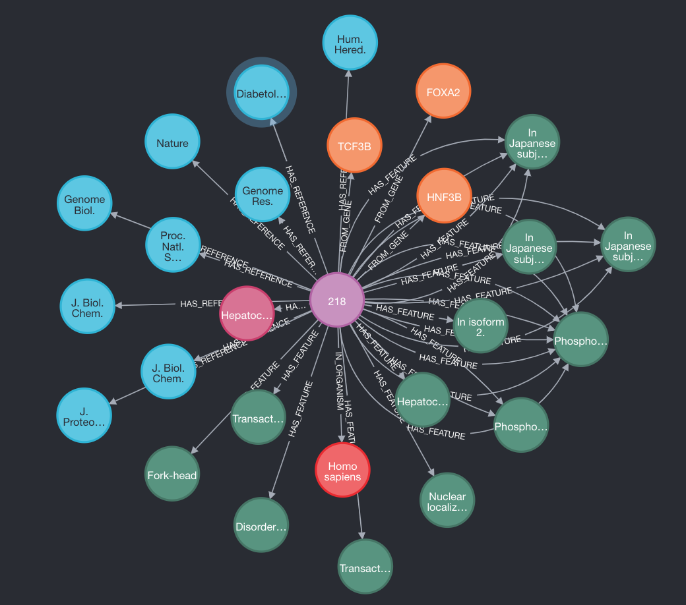
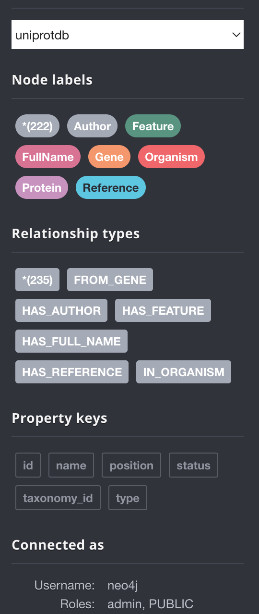
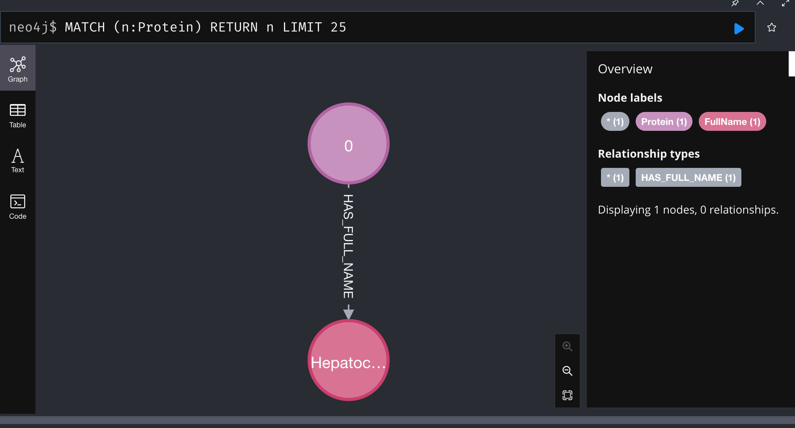
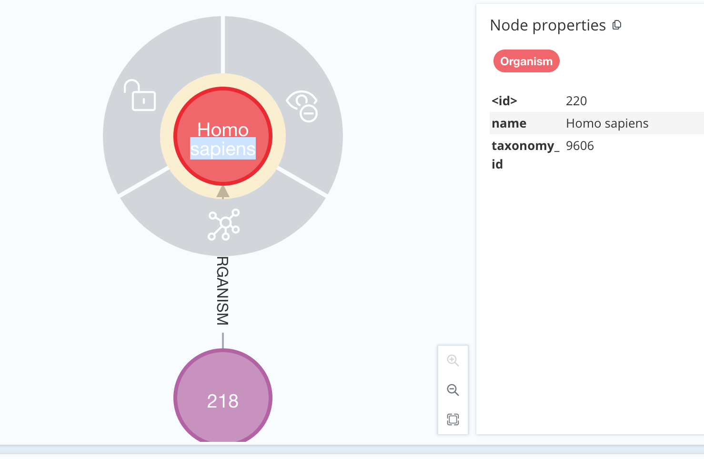
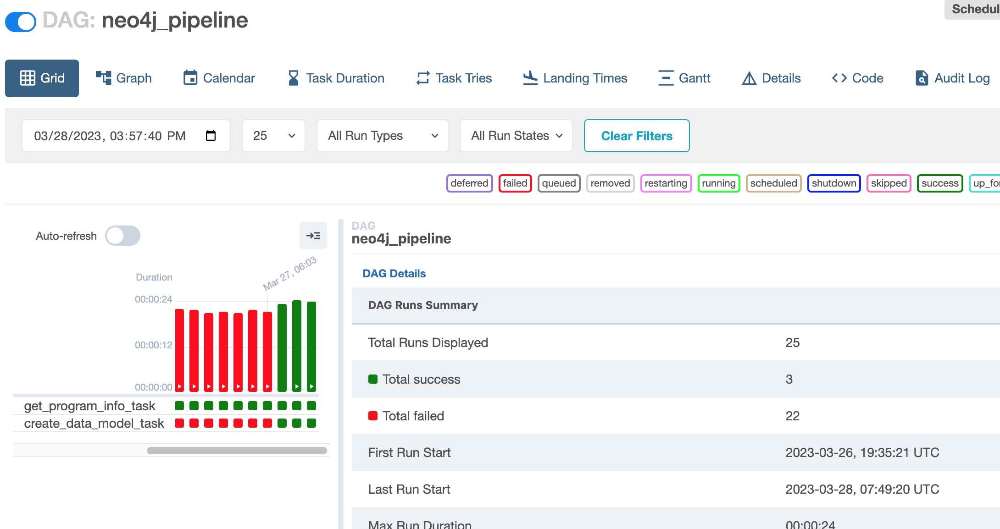

# Creating a Data Pipeline with Neo4j Ghap, Python, Airflow, and XML File Ingestion 
by Eimis Pacheco

## Introduction

This was an interesting data engineering challenge, which more than a coding challenge was a tool settings challenge too, since I did not have Airflow or Neo4j installed in my personal computer. So I started installing Airflow and Neo4j desktop, installing all required Python libraries and then doing some extra tool settings since I was having some issues related to tool settings.

Working with these tools in this particular data pipeline can be enjoyable because it involves ingesting and processing biological data, which can be fascinating and intellectually stimulating.

By the end of this instructions, you should be able to reproduce this solution in your own environment. 

### Step 1: Setting up the Environment
Before we can start building our pipeline, we need to set up our environment. This tutorial assumes you have already installed Python, Airflow, and Neo4j Desktop. If you haven’t installed these tools yet, follow these steps:

**Python:**
Download and install the latest version of Python from the official website: https://www.python.org/downloads/
Create and activate a virtual enviroment so that we ensure that we will have all the needed packages for this project without altering others
python -m venv myenv
source myenv/bin/activate

 **Airflow:**
Install Airflow using pip: pip install apache-airflow
Initialize the Airflow database: airflow initdb airflow create_user -r Admin -u <username> -e <email> -f <first_name> -l <last_name> -p <password>
Start the Airflow webserver: airflow webserver -p 8080
Start the Airflow scheduler: airflow scheduler

 **Neo4j Desktop:**
Download and install Neo4j Desktop from the official website: https://neo4j.com/download/
Install Neo4j Desktop on your machine.

### Step 2: Installing Required Libraries
We will be using the following Python libraries for our pipeline:

**Install these libraries using pip:**
xmltodict: To convert the XML file to a Python dictionary.
neo4j: To interact with Neo4j database using Python.
pip install xmltodict neo4j

## Step 3: Configuring Neo4j Desktop
We need to create a new database in Neo4j Desktop for our pipeline. Follow these steps:
Open Neo4j Desktop.
Click on the “Create a New Project” button.
Give the project a name and click on the “Create” button.
Click on the “Add Database” button.
Select “Create a Local Graph” and click on the “Create” button.
Give the database a name and click on the “Create” button.
Set the password for the database and click on the “Create” button.
Install APOC library to be able to interact with DB using cypher queries.

## Step 4: Writing the Python Code
We will now write the Python code for our pipeline. Our pipeline will consist of the following steps:
Read the XML file and convert it to a Python dictionary for easy manage.
Extract the necessary data from the dictionary.
Create nodes in the Neo4j database for each proteins node and related ones.
Create relationships between the proteins node and related ones.

## Step 5: Airflow Settings
Put the uniprot_dag.py file in the dag folder of the airflow folder, in my case, this folder was not created so I created it myself.
Go to airflow.cfg file and modify the dags_folder parameter "dags_folder = /Users/eimispacheco/airflow/dags"
Change this min_file_process_interval parameter to 5 to make your dag changes much faster
Create a appSettingPath variable in Admin Menu which is a variable that will point to the location of your configuration file (I try to show the least data possible in code, including paths)

## Step 6: Change the variable in the configuration file (dwh.cfg) accordingly.

## Step 7: Enjoy the results and improve (Everything is improveable for sure)

## Possible Improvements:
1. Using logging to debug: The code currently uses print statements for debugging.
2. Using a more efficient XML parser: The xmltodict library can be slow for large XML files.
4. Using distributed computing: I would use pyspark instead
5. Usage of data compresion.

**Result**

All Nodes

Airflow

